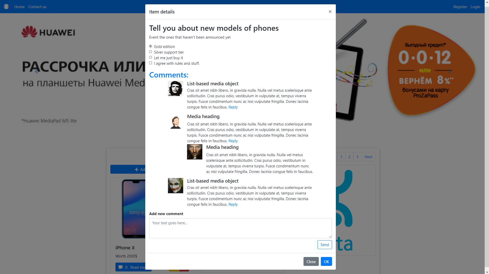
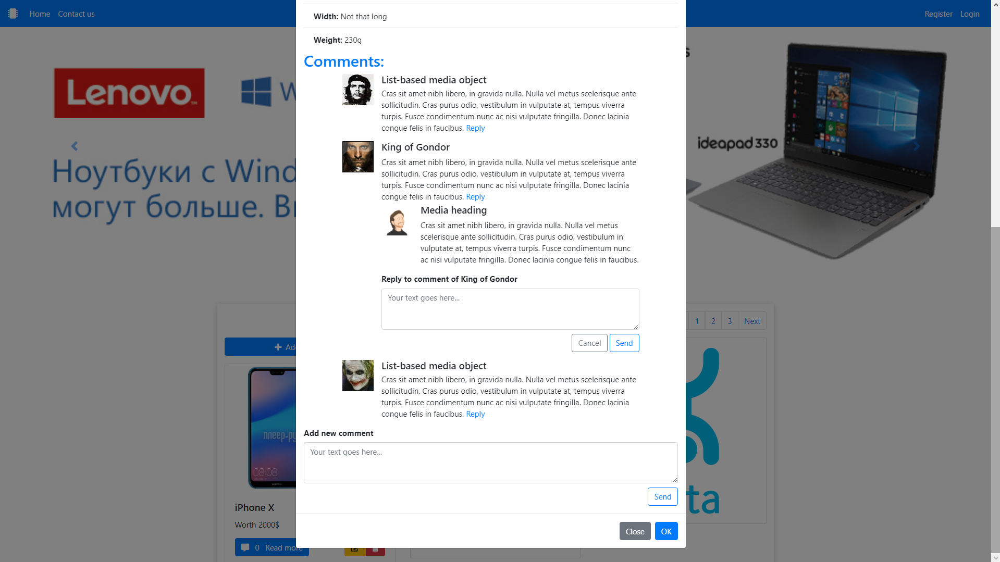
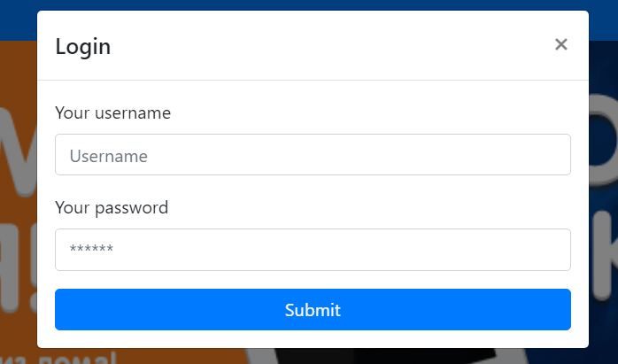
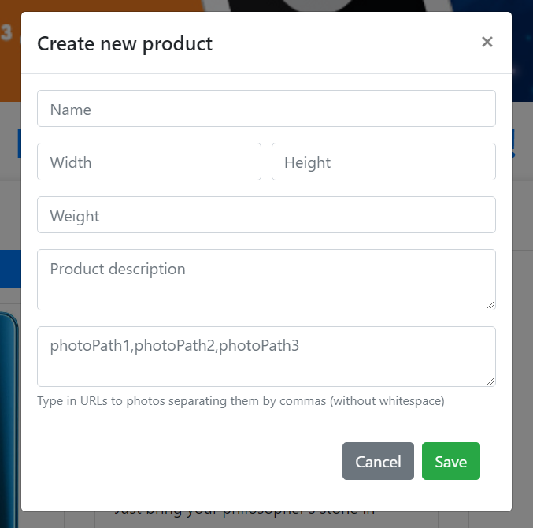
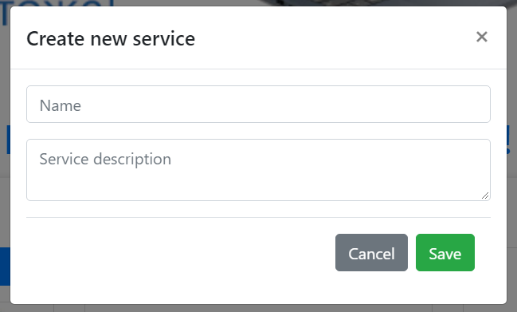

# Контрольная работа #2, вариант 1
## Задача:
 
Ваша задача - реализовать веб-сайт по продаже услуг и товаров с использованием Bootstrap 4 и Fetch API.

### Шаблон

Шапка состоит из: 
* Кликабельного логотипа, который ведёт к началу страницы. 
* Навигационного меню: 
  * Home - поведение при клике аналогично клику на логотип. 
  * Contact us - при клике ведёт к форме обратной связи, расположенной в футере. 
  * Register - при клике открывается модальное окно с регистрационной формой.
  * Login - при клике открывается модальное окно с формой входа на сайт.
  
* При уменьшении ширины экрана меню схлопывается в “бутерброд”.

Для иконок следует использовать FontAwesome. 

Под шапкой располагается карусель, она выводится во всю ширину экрана. Основным контентом страницы является область с картами, перед (и после) которой находится pager. 

Область с картами состоит из карт 3-х типов: 
* Товары. Всегда слева. Над списком товаров находится кнопка создания нового товара, которая открывает соответствующую форму.
* Услуги. Изначально по центру, могут менять своё положение (см видео). Над списком услуг находится кнопка создания новой услуги, которая открывает соответствующую форму.
* Рекламный баннер. Изначально справа, может менять своё положение. 

На кнопке "Read more" товара должен отражаться счётчик комментариев, оставленных к этому товару. 

Область с картами должна быть отзывчивой - ширина колонок меняется, как и их положение или наличие на экране, обратите внимание на это в видео. 

На каждом товаре и услуге отображаются иконки редактирования и удаления. При нажатии на иконку редактирования должна открываться та же форма, что и при создании товара/услуги с заполненными полями формы. При нажатии на иконку удаления должно происходить удаление элемента со страницы. При обновлении страницы элемент не должен показываться снова.
При клике на товар или услугу открывается модальное окно.  
Модальное окно товара содержит: 
* Карусель с изображениями.
* Характеристики товара.

Товар: 

Услуга: 

Модальное окно услуги содержит форму с “настройками” сервиса. 

Также в обоих модальных окнах находятся древовидные комментарии и форма для отправки нового комментария. Максимальный уровень вложенности комментов - 1. На комментарии верхнего уровня отвечать можно, на вложенные комментарии - нельзя.

Комментарии:

В футере расположена форма обратной связи, футер не является “липким”. 

# Порядок работы

Чтобы заполнить магазин товарами и услугами, необходимо проделать следующие шаги:
1) Заполнить форму регистрации и провести её отправку. Ключевые поля - это name (Username на видео) и password. Остальные поля могут оставаться незаполненными.
2) После отправки формы регистрации необходимо залогиниться через форму логина. В ответ на введённые имя пользователя и пароль вам будет отправлен токен аутентификации, который вы будете прикреплять ко всем последующим запросам.

3) Через кнопки добавления с помощью заполнения форм можно добавлять на сайт новые товары и услуги. Токен аутентификации должен прикрепляться к запросу в момент отправки формы.

Ссылки на изображения можно брать в интернете, или воспользоваться заготовленным списком:   

Устройства:  
https://i.postimg.cc/cHCHDVPw/1.jpg  
https://i.postimg.cc/sD7p9hYy/2.jpg  
https://i.postimg.cc/9X4P0SzD/3.jpg  
https://i.postimg.cc/G9wmm9tx/4.jpg  
https://i.postimg.cc/05LYwfJc/5.jpg  
https://i.postimg.cc/cHzJPFNj/6.jpg  
https://i.postimg.cc/mg47dgj9/8.jpg  
https://i.postimg.cc/L5ZsSj9s/9.jpg  
https://i.postimg.cc/K85BChpH/10.jpg

Аватарки:  
https://i.postimg.cc/DzyLTpty/ava-1.jpg  
https://i.postimg.cc/N0JTf7c8/ava-2.png  
https://i.postimg.cc/QC5Wb2WS/ava-3.gif  
https://i.postimg.cc/nzXmsjFy/ava-4.jpg  
https://i.postimg.cc/pT3FKWyp/ava-5.jpg  

Спецификация API тут: [Swagger](https://midterm2.front.kreosoft.space/index.html)
# Система оценивания: 
[Ссылка на правила оценивания](https://docs.google.com/document/d/1ixWN6nIsF1bz21QiXg4IfQKcr64zwSlIiAO0gsF-28g/edit?usp=sharing)
## Дополнительно: 
Ограничение количества отображаемых товаров и услуг с помощью пагинации. Так, например, после получения списков товаров и услуг можно отображать на первой странице по первые 10 элементов, после переключения на вторую - с 11 по 20 и т.д.

# Видео
Видео с демонстрацией [доступно по ссылке](https://drive.google.com/drive/folders/1nOSKIa53DTvuwgfJ7Tq2yWzcxG12IbOz?usp=sharing)